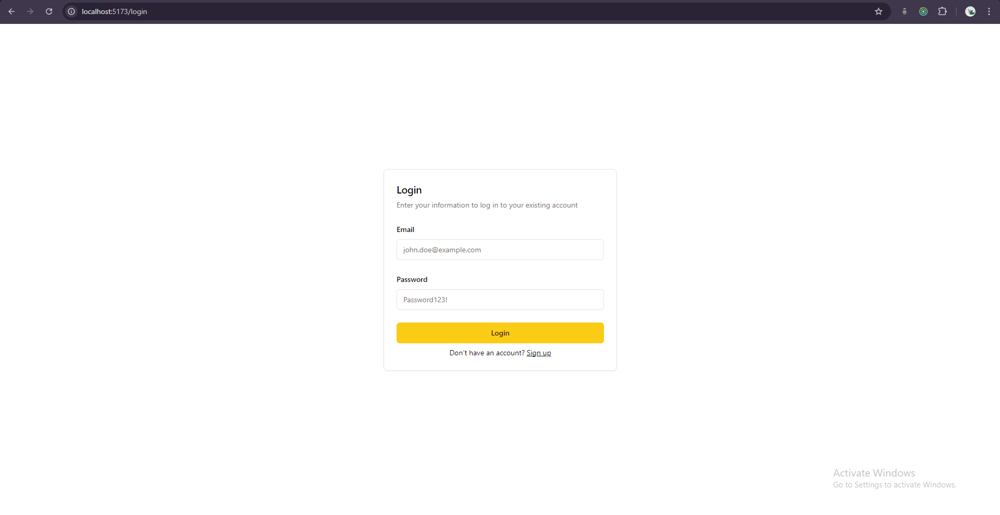
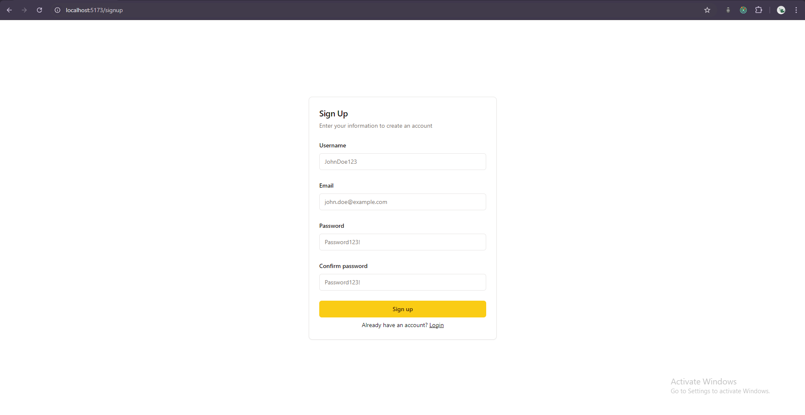
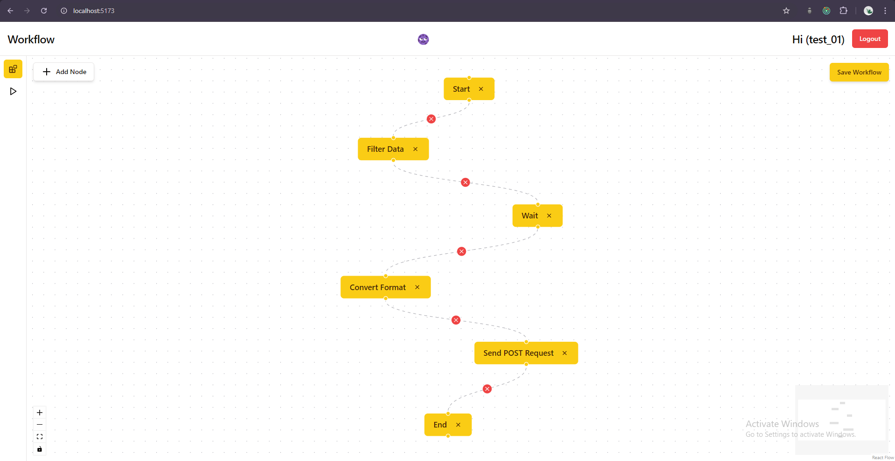
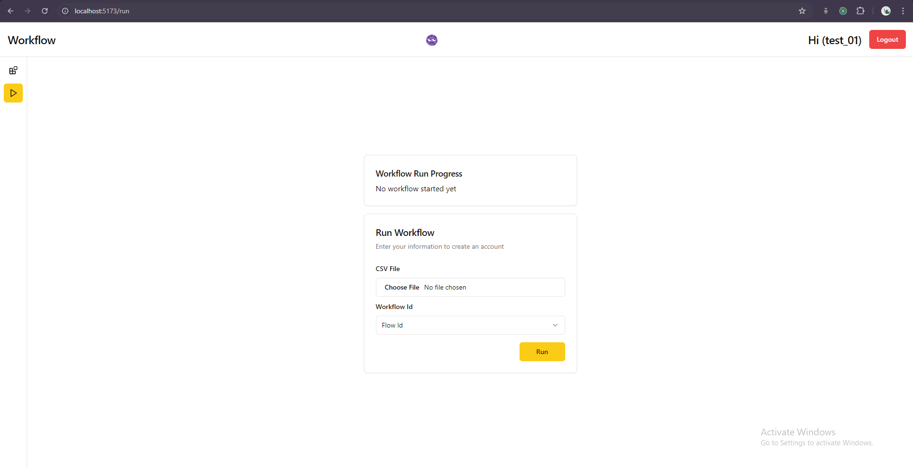
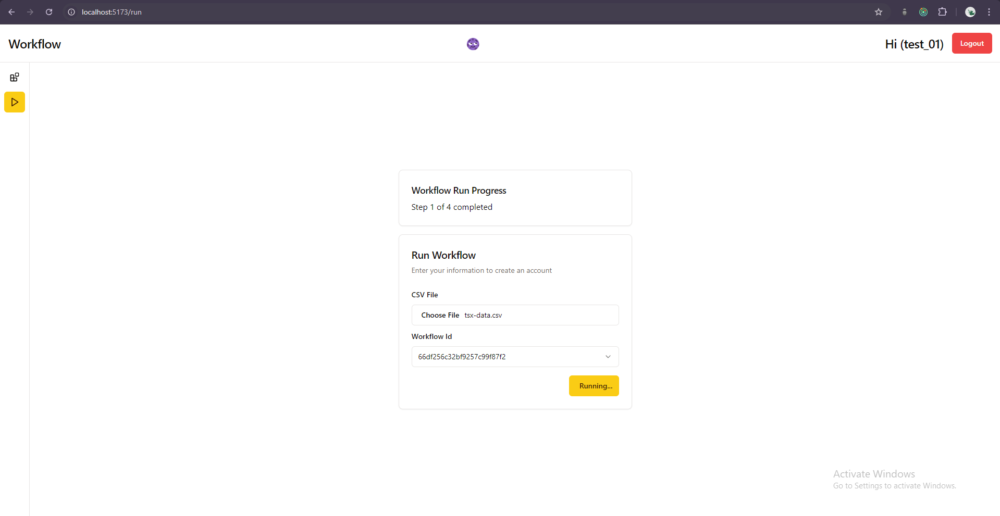

# Workflow Server

A web app for creating and executing work flows.

## Demo

https://drive.google.com/file/d/14UE10YRW63bIIsGcAcCM12qwzW8nBpjc/view?usp=drive_link

### Screenshot

## Tech Stack

Node, Express, Multer, JWT, MongoDB

## Repository Link

[CLient](https://github.com/Abhijit-7976/Workflow_Client)
[Server](https://github.com/Abhijit-7976/Workflow_Server)
